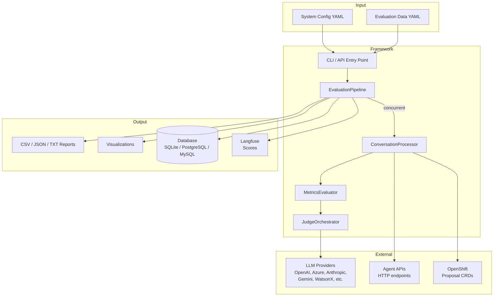
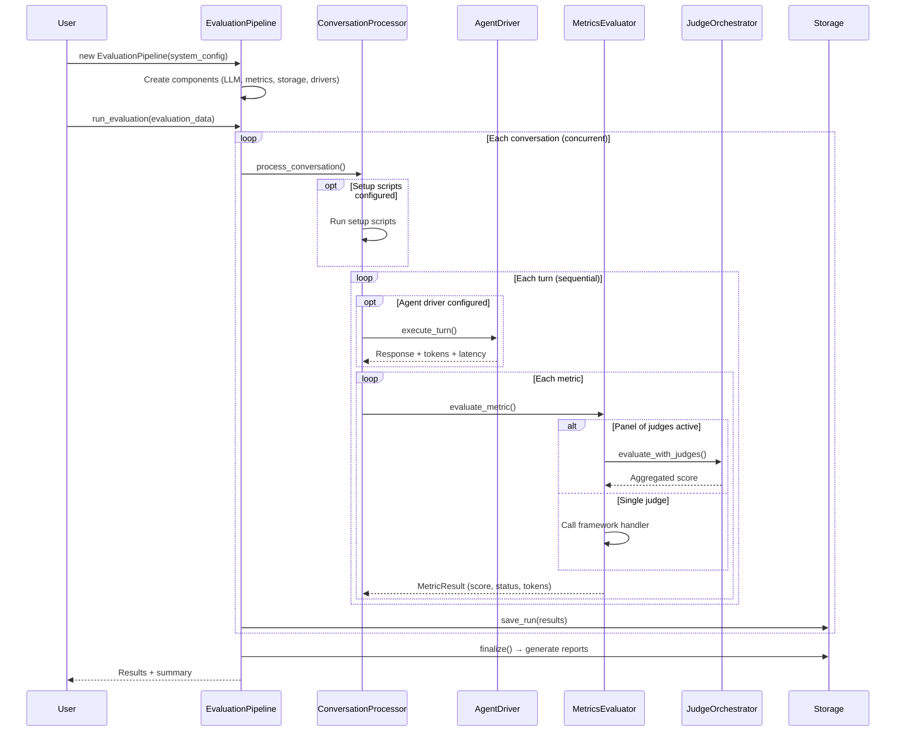
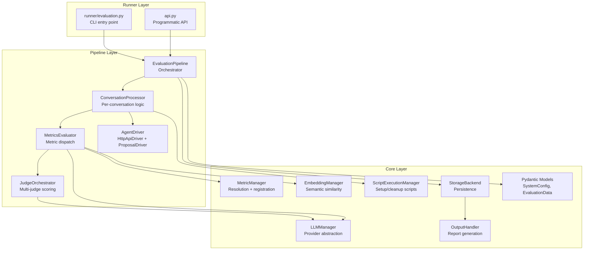
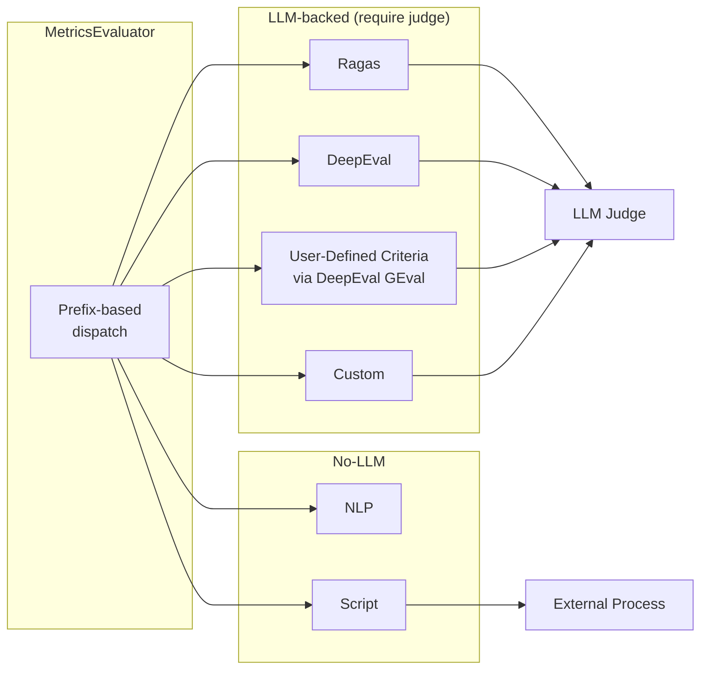
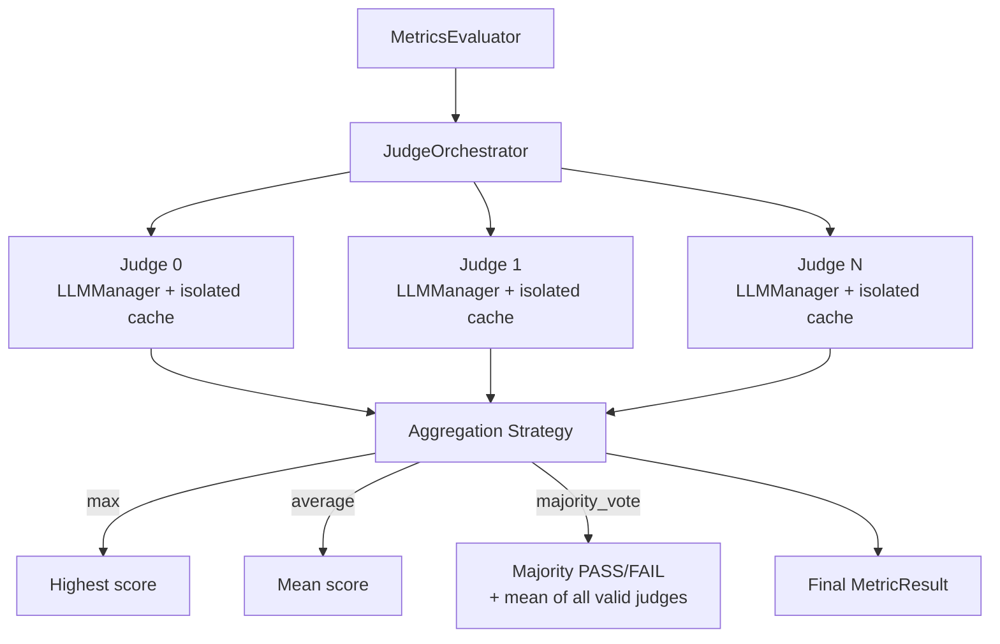
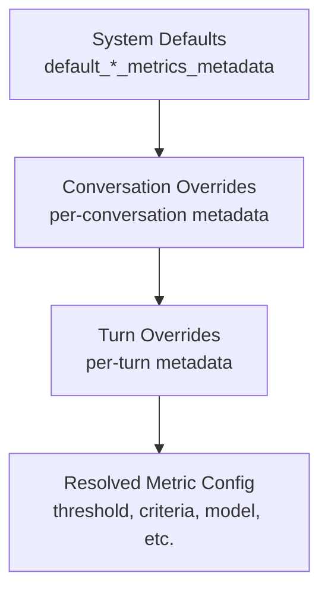
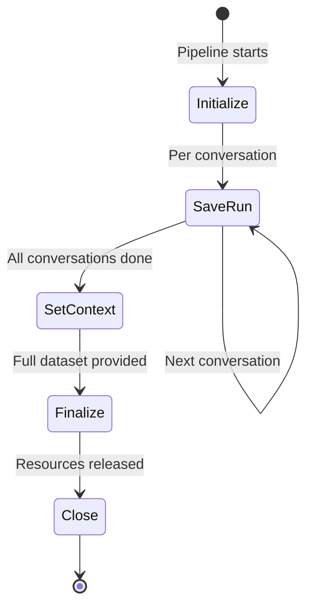
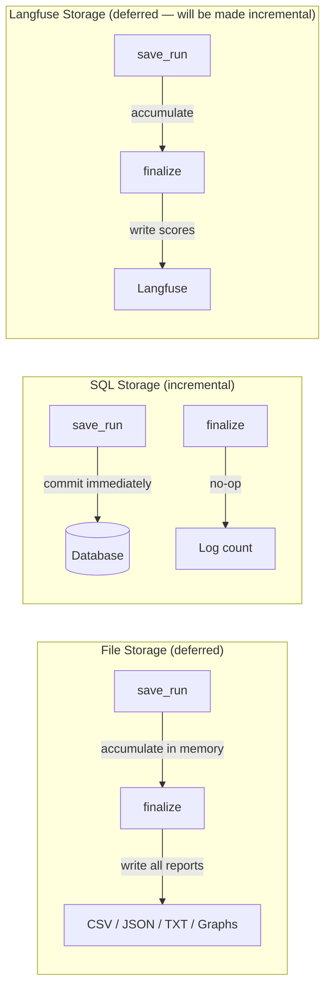

# Architecture

Lightspeed Evaluation Framework is a Python-based evaluation system for LLM-powered applications. It evaluates responses, context quality, tool calls, conversation flows, and agentic workflow outcomes — using both live (API/agent-driven) and offline (pre-populated) data. It supports multiple evaluation backends (Ragas, DeepEval, NLP, custom, script-based), user-defined evaluation criteria, panel-of-judges scoring, statistical analysis, environment setup/cleanup scripts, and pluggable agent drivers. Conversations and turns are defined in YAML, scored against configurable metrics using LLM judges, and results are produced as reports.

## System Overview

The framework separates **what to evaluate** (evaluation data) from **how to evaluate** (system configuration). Users provide two YAML files: one defining conversations and turns to evaluate, and one configuring judges, metrics, storage, and infrastructure.

## Evaluation Flow

A single evaluation run follows this path:

## Component Architecture

The framework is organized in three layers:

## Metric Evaluation

The framework routes metrics to backend-specific handlers based on prefix (`ragas:`, `deepeval:`, `nlp:`, etc.). Each handler wraps its upstream library and normalizes results to a common score/status model.

## Judge Panel

When configured, multiple LLMs independently score each metric and results are aggregated:

## Configuration Resolution

Metric metadata (thresholds, criteria, weights) cascades through three levels, with the most specific level winning:

## Storage Lifecycle

Three storage backends share the same lifecycle but implement it differently:

## Key Architectural Decisions

**Separation of system config and evaluation data.** The system config (judges, metrics, infrastructure) changes infrequently. The evaluation data (conversations, turns) changes per run. Keeping them in separate files lets teams share a system config across many evaluation datasets.

**Metric resolution hierarchy.** Turn-level overrides > conversation-level overrides > system defaults. This lets users tune thresholds or criteria for specific test cases without duplicating the full config.

**Pluggable agent drivers.** The framework operates in two modes: live (agent drivers collect responses then evaluate) and offline (evaluate pre-populated data). Two driver types exist — `http_api` for HTTP API calls and `proposal` for OpenShift CRD-based proposal workflows. The driver registry pattern makes it straightforward to add new driver types.

**Concurrent conversations, sequential turns.** Conversations are independent and can be evaluated in parallel. Turns within a conversation are sequential because they may depend on prior context (multi-turn conversations).

**Storage lifecycle pattern.** Initialize → save per conversation → finalize → close. This enables incremental persistence (each conversation saves immediately) while deferring expensive report generation to the end when all results are available.
